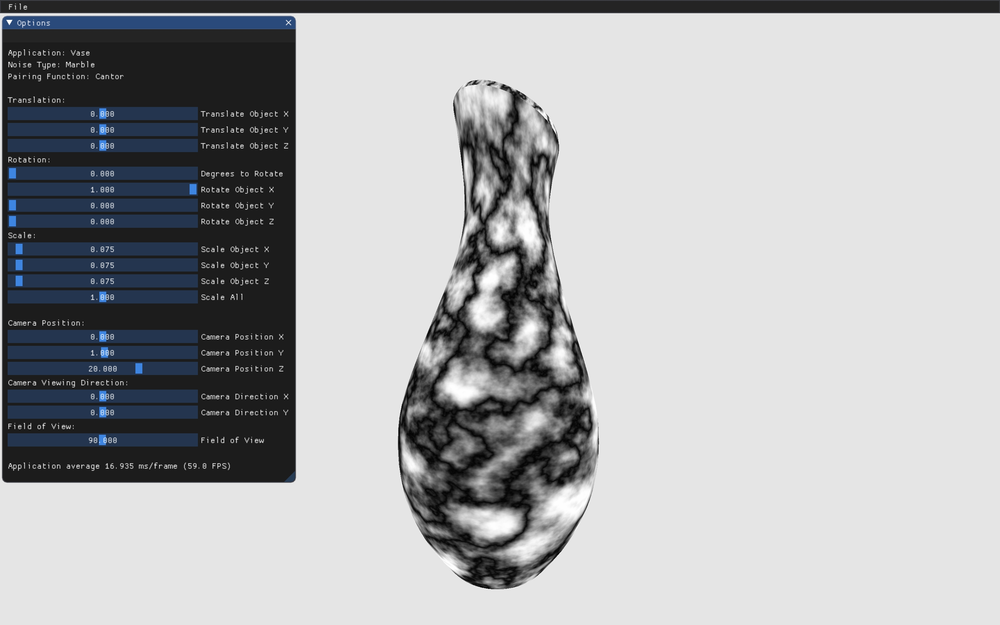

# ProceduralNoise

Noise generation and applications using various hashing techniques.

### Pairing Function Implementations:

  1. Linear Function 
      - `y * width + x`
  2. Cantor Pairing Function
      - `((x + y) * (x + y + 1)) / 2 + y`
  3. Szudzik Pairing Function 
      - `(x >= y) ? (x^2 + x + y) : (y^2 + x)`
  4. Rosenberg-Strong Pairing Function 
      - `(max(x, y))^2 + max(x, y) + x - y`

### Noise Implementations:

  1. Perlin Noise
  2. Gabor Noise
      - Heavily based on the SIGGRAPH paper [Procedural Noise using Sparse Gabor Convolution](http://graphics.cs.kuleuven.be/publications/LLDD09PNSGC/) and related C++ implementation from Ares Lageo, Sylvain Lefebvre, George Drettakis, Philip Dutre, Katholieke Universiteit Leuven and REVES/INRIA Sophia-Antipolis. 
  3. Marble Noise
  4. Worley Noise
  5. Curl Noise (in progress)

### UI Implementation:
A user inferface, utilizing [Dear, ImGui](https://github.com/ocornut/imgui), has been implemented. This allows for an enhanced view and increased interaction with the application of which is rendered. 

###### UI Features:
Primarily in progress. The goal is to allow user to dynamically generate noise, load meshes, run analysis, save images and render desired applications from the UI.

  1. Generate noise (in progress)
  2. Load meshes (in progress)
  3. Load textures (in progress)
  4. Run analysis (in progress)
  5. Save images via UI 
      - Application Image
      - Noise Image (in progress)
      - Analysis Image (in progress)

### Building & Running:

  1. CMake (Follow below or run within IDE - CLion or QTCreator)
      - Run  `cmake -H. Bbuild` from inside main directory.
      - Run  `cmake --build build -- -j3` from inside main directory.
      - Executable located in `/build/` folder and run with `./Perlin`.

### Other Considerations:

There are various modes that can be enabled/disabled in the `Driver.cpp` file. 

  1. Analysis Mode 
      - Outputs `<Type>Analysis_Pair<#>_Noise<#>_W<#>_H<#>.csv` of which is used to analyze results of the various functions.
        - Type: Fournier or Analysis
        - Pair: 0 - Linear, 1 - Cantor, 2 - Szudzik, 3 - Rosenberg Strong
        - Noise: 0 - Perlin, 1 - Gabor, 2 - Marble, 3 - Worley
        - W: Width 
        - H: Height
      - Ability to enable/disable amplitude and Fourier analysis.
  2. Save Noise Image Mode
      - Saves an image to .bmp.
  3. Application type
      - Renders and saves generated noise in the following applications
          - Texturing OBJ files
          - Procedural landscape (in progress)
          
### Library Requirements:
  1. [Assimp](https://www.assimp.org/)
  2. [Eigen3](https://eigen.tuxfamily.org/dox/)
  3. [OpenGP](https://github.com/OpenGP/OpenGP)
  4. [OpenGL](https://www.opengl.org/)
  5. [GLEW](http://glew.sourceforge.net/)
  6. [GLFW3](https://www.glfw.org/)
  7. [OpenCV](https://opencv.org/)
  8. [OpenGL Mathematics](https://glm.g-truc.net/0.9.9/index.html)
  9. [ImGui](https://github.com/ocornut/imgui)
  10. [Single-File Public Domain Libraries](https://github.com/nothings/stb)
